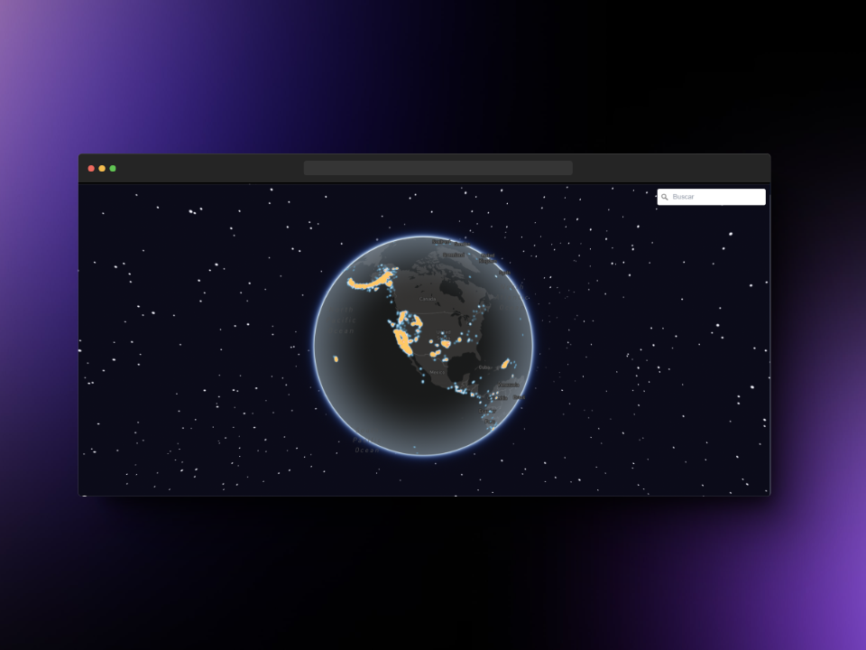
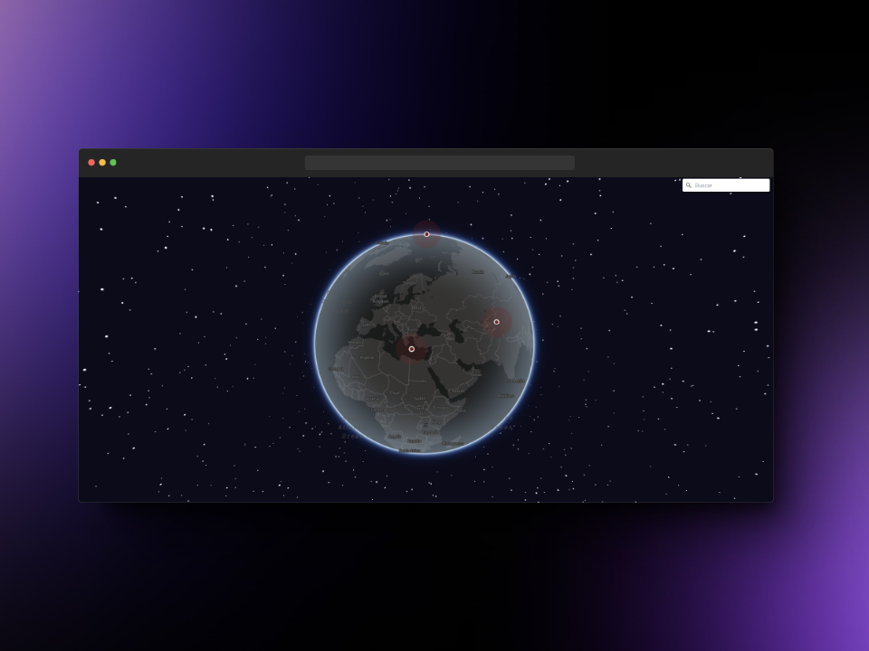

# Earthquake Map

"En el abrazo tumultuoso de la Tierra, los terremotos esculpen la narrativa de la naturaleza, recordándonos nuestra fragilidad en la danza eterna entre la fuerza y la vulnerabilidad."





# TODO

- [x] Representar el mapa como esfera
- [x] Visualizar puntos latentes en el mapa
- [x] Buscador por ciudad municipio...
- [ ] Filtrado de terremotos por mes semana dias
- [ ] Muestra de informacion de los terremotos al hacer hover sobre ellos
- [ ] Posibilidad de representar con mapas de calor o con puntos latentes.

# Como levantar el proyecto

* Clonado del proyecto
  
```
git clone https://github.com/Allorentee/Earthquakes-Map.git
```

* Instalacion de dependencias
  
```
npm i
```

* .ENV

```
Para visualizar el mapa correctamente requiere en el .env del proyecto una variable llamda VITE_MAP donde hay que meter la key correspondiente de la libreria de mapbox

https://www.mapbox.com/
```


* Levantar el proyecto
  
```
npm run dev
```

